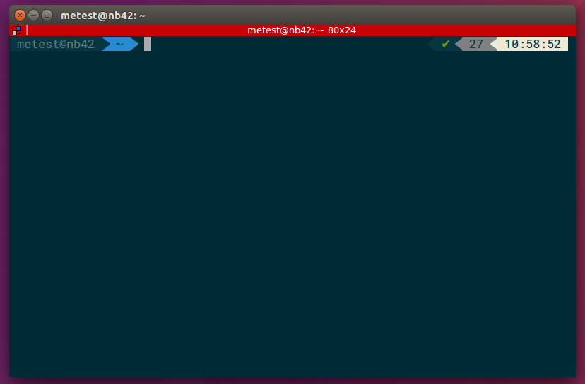
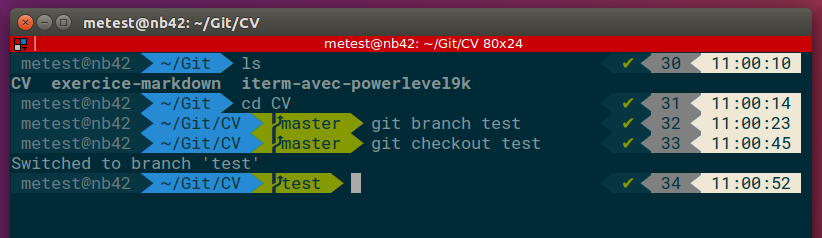

# Terminator, OhMyZsh et Powerlevel9K sur Linux

## Sommaire

1. Installer Terminator
2. Installer ZSH
3. Installer OhMyZsh 
4. Télécharger et installer les polices
5. Installer Powerlevel9k
6. Configurer Terminator

[Source](https://gist.github.com/renshuki/3cf3de6e7f00fa7e744a)

## Etapes:

### Installer Terminator:

	sudo apt-get install terminator

> Fermer le terminal puis le relancer via le raccourci clavier "Ctrl+Alt+T".

### Installer ZSH:

	sudo apt-get install zsh

#### Changer l'interpretateur de commande via:
 	
	chsh

#### A la question "Login Shell [/bin/bash]", répondre:

	/bin/zsh
	

> Fermer le terminal puis le relancer via le raccourci clavier "Ctrl+Alt+T".

### Installer Oh My ZSH:

	sh -c "$(curl -fsSL https://raw.github.com/robbyrussell/oh-my-zsh/master/tools/install.sh)"

### Télécharger et installer les polices:

> Passer les commandes suivante dans le terminal (l'une après l'autre):

	wget https://github.com/powerline/powerline/raw/develop/font/PowerlineSymbols.otf
	mkdir ~/.fonts/
	mv PowerlineSymbols.otf ~/.fonts/
	mkdir -p .config/fontconfig/conf.d
	fc-cache -vf ~/.fonts/
	mv 10-powerline-symbols.conf ~/.config/fontconfig/conf.d/
        

### Installer Powerlevel9k:

#### Installer via Git:

	git clone https://github.com/bhilburn/powerlevel9k.git ~/.oh-my-zsh/custom/themes/powerlevel9k

#### Et editer le fichier .zshrc dans le dossier Home:

	nano ~/.zshrc

#### Ajouter d'abord cette ligne en tête du fichier:

	export TERM="xterm-256color"

#### Puis changer la valeur de cette ligne:

	 ZSH_THEME="robbyrussell"

#### par celle ci:

	 ZSH_THEME="powerlevel9k/powerlevel9k"

et enregistrer!

### Configurer votre nouveau terminal (Terminator):

Clic droit sur le terminal > Preferences puis Profiles > General:

Décocher "Use the system fixed width font" et dans "Font" choisir "Roboto Mono for Powerline" (Size 13).
			   
Dans Profiles > Colors:

Décocher "Use colors from system theme" et dans "Built-in schemes" choisir "Solarized dark" puis dans la section "Palette" choisir "Solarized".

### Et voila:

